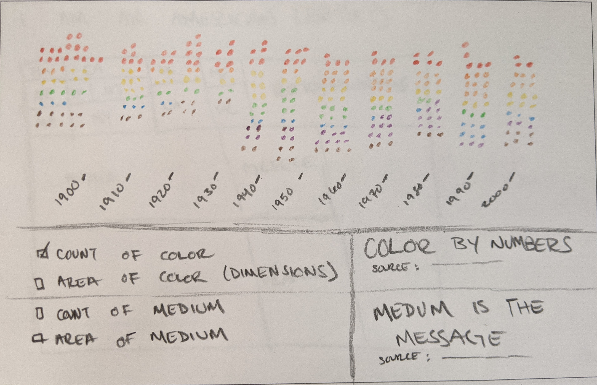
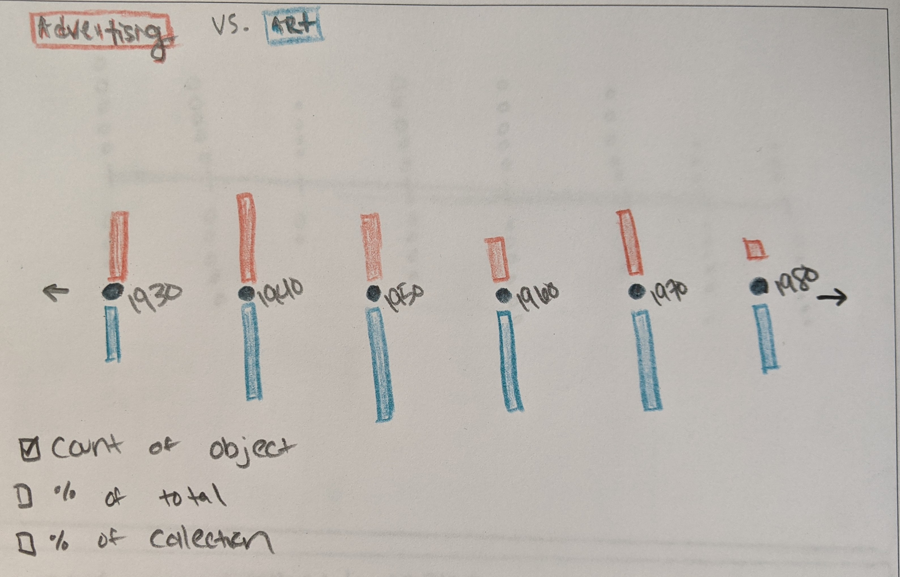
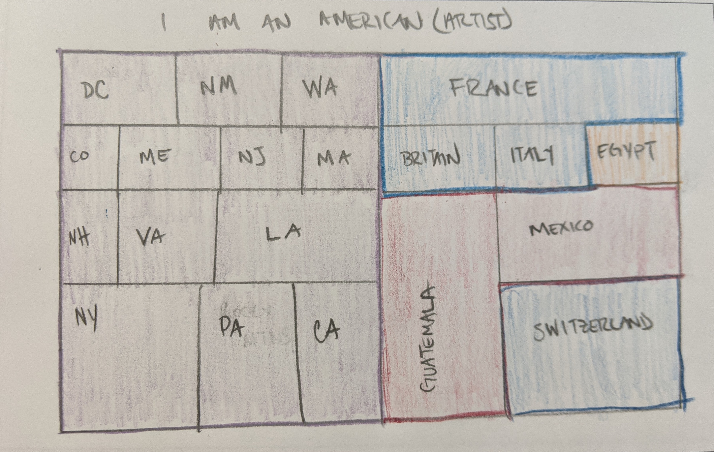

# Data Visualization Major Studio 1 Fall 2021
## Shea Molloy | Assignment 1 brainstorming

In looking through the datasets available in SI and various institutional collections, I've found that art and culture databases tended to inspire more questions in regards to the relationships between the images and data points while providing enough datapoints to tell an interesting story. I'm most interested in examining art, design, or engineering over time and I'd like to explore trend analysis through data visualization. See [here](https://docs.google.com/document/d/1SNF1BgPnOr2m5we1ozlK3mp-jXZS1CVq8DhAbI9GUps/edit?usp=sharing) for more exploration notes.

---

### [Cooper Hewitt](https://collection.cooperhewitt.org/) | Design Over Time
The Cooper Hewitt collection inspires questions about design trends over time, such as:

- *What color defines each decade?*
- *What mediums were popular and when?*
- *What other design trends reflect cultural shifts?*

For this initial quantitative visualization, I'd like to display the count of colors in archived objects according to the [Cooper Hewitt database](https://www.si.edu/search/collection-images?edan_q=&edan_fq%5B0%5D=unit_code%3ACHNDM%20OR%20unit_code%3ACHNDM_BL%20OR%20unit_code%3ACHNDM_YT&edan_fq%5B1%5D=%28set_name%3A%22Drawings%2C%20Prints%2C%20and%20Graphic%20Design%20Department%22%20AND%20set_name%3A%22Cooper%20Hewitt%2C%20Smithsonian%20Design%20Museum%20Collection%22%29&edan_fq%5B2%5D=object_type%3A%22Decorative%20arts%22%20OR%20object_type%3A%22Design%20drawings%22%20OR%20object_type%3A%22Drawings%22%20OR%20%22Embroidery%20%28visual%20works%29%22%20OR%20object_type%3A%22Prints%22%20OR%20object_type%3A%22Textiles%22&edan_fq%5B3%5D=media_usage%3A%22CC0%220) grouped by decade as a [Dot Matrix Chart](https://datavizcatalogue.com/methods/dot_matrix_chart.html) This could either be executed in 7-10 generalized groups or according to hex code prefixes. The data points overlap quite a bit (i.e. more than one color per object) and total **71,543** datapoints (some CC0, some not) - but otherwise the data from CH seems very flexible. Alernatively, I could display total dimension of objects organized by medium/decade as a [Proportional Area Chart](https://datavizcatalogue.com/methods/area_chart.html)from the [**18k+ CC0 images** in the Drawings, Prints and Graphic Design Cooper Hewitt Collection in SI](https://www.si.edu/search/collection-images?edan_q=&edan_fq%5B0%5D=unit_code%3ACHNDM%20OR%20unit_code%3ACHNDM_BL%20OR%20unit_code%3ACHNDM_YT&edan_fq%5B1%5D=%28set_name%3A%22Drawings%2C%20Prints%2C%20and%20Graphic%20Design%20Department%22%20AND%20set_name%3A%22Cooper%20Hewitt%2C%20Smithsonian%20Design%20Museum%20Collection%22%29&edan_fq%5B2%5D=object_type%3A%22Decorative%20arts%22%20OR%20object_type%3A%22Design%20drawings%22%20OR%20object_type%3A%22Drawings%22%20OR%20%22Embroidery%20%28visual%20works%29%22%20OR%20object_type%3A%22Prints%22%20OR%20object_type%3A%22Textiles%22&edan_fq%5B3%5D=media_usage%3A%22CC0%22). 

----

### [National Museum of American History](https://americanhistory.si.edu/collections/object-groups) | Advertising and Art in America
The National Museum of American History collection is by far one of the more visually interesting in the SI collection as a whole, and I'm interested in exploring the relationship between visual objects and American values. I explored the art, invention, and advertising collections topics in the [NMAH collection site](https://americanhistory.si.edu/collections/subjects). I'd primarily like to examine the question *what is the relationship between art and advertising in America?*

Comparing the quantity of advertising and art objects from the collection would give us a total of **8,885 CC0 images** for datapoints, and it would be possible to organize them over time as a [Bar Chart](https://datavizcatalogue.com/methods/bar_chart.html) or [Marimekko Chart](https://datavizcatalogue.com/methods/marimekko_chart.html), with an optional filter for technology, communication tools, etc. 

---

### [American Art Museum](https://americanart.si.edu/) | I Am An American (Artist)
In examining the American Art museum collections, I was pleasantly surprised to see artists from Mexico, Guatemala, and Egypt represented as well as the Rocky Mountains, the Southwestern, and smaller states/D.C. This inspires the questions:
- *Where are American artists from?* 
- *Are all the states represented in American Art?*
- *Is American Art a melting pot?*

I would look at the [**12225 CC0 images**](https://www.si.edu/search/collection-images?edan_q=&edan_fq%5B0%5D=unit_code%3AAECI%20OR%20unit_code%3ASAAM%20OR%20unit_code%3ASAAMPAIK%20OR%20unit_code%3ASAAMPHOTO%20OR%20unit_code%3ASAAM_BL%20OR%20unit_code%3ASAAM_PC%20OR%20unit_code%3ASAAM_YT%20OR%20unit_code%3AARI&edan_fq%5B1%5D=media_usage%3A%22CC0%22) from the SI interface to create a [Tree Chart](https://datavizcatalogue.com/methods/treemap.html) or perhaps a [Bubble Map](https://datavizcatalogue.com/methods/bubble_map.html) of the count of art objects organized by "place" - which may need some reorganization as the quality of the data isn't particularly consistent.

P.S. The name "I am an American Artist" is a riff on the song ["Babelogue" by Patti Smith](https://www.youtube.com/watch?v=2wDmR4sYZ2U)

---

